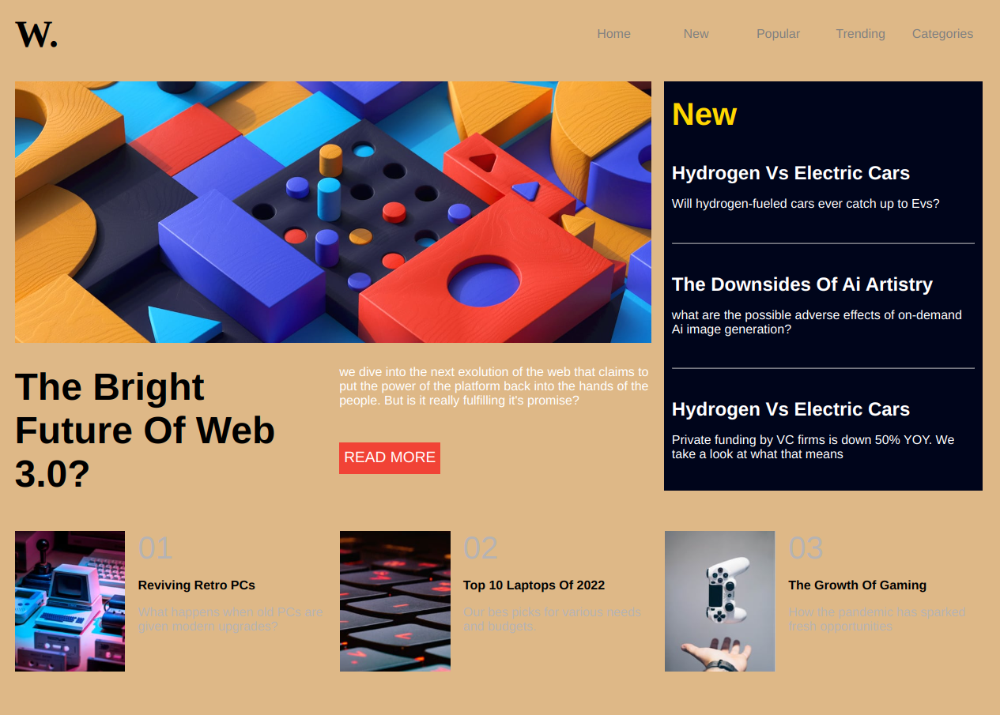

# NEWS HOMEPAGE

## Project Review

## About
This project nothing more than one of my mescellanous exercises to help build my skill

## BUILT WITH
This page is basically built with just
* HTML and
* CSS for styling.
* and abit of css

### PREREQUISITES
* You should already have a stable browser to use.
* Internet connection
* and be familiar with GitHub

## CLONE PROJECT
* open your terminal
* type and run this comand (`git clone git@github.com:RashJrEdmund/News-homepage.git`)
* change to the project directory by entering: cd My-food
* Note That: all this is done using your Linux terminal or git-bash for windows users.

## Command-line steps

- $ git clone `https://github.com/RashJrEdmund/News-homepage`
- $ `cd news-homepage`
- $ `git checkout feature/body`

## CONTRIBUTION
Contributions, issues, and feature requests are welcome!
Feel free to check the [issues page](https://github.com/RashJrEdmund/News-homepage/issues).

## Live Site

[Link](https://rashjredmund.github.io/News-homepage/)

## AUTHOR
**RASH**
- GitHub: [@RashJrEdmund](https://github.com/RashJrEdmund/News-homepage)

## License
This project is [w3school](./LICENSE) licensed.